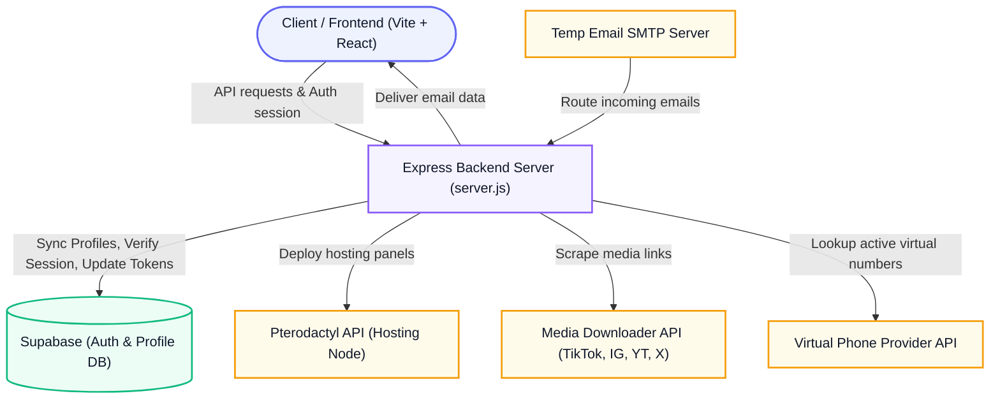

# Cexistore Tempmail Web

A modern, fast, and secure temporary email service and privacy dashboard built with Vite + React on the frontend and an Express backend under `server/`.

## Features

- **Instant Temporary Emails**: Generate disposable email addresses immediately with a 30-minute self-destruct timer.
- **Virtual Persona Generator**: Instantly generate realistic virtual personas (names, phone numbers, identity numbers, and passwords) to protect your real identity online.
- **Media Downloader**: Download media links from platforms like TikTok, Instagram, YouTube, and X / Twitter directly.
- **Virtual Number Providers**: Quick access to free online virtual number providers for temporary SMS verifications.
- **Premium Upgrades**: Flexible plans (Free, Pro, VVIP) supporting custom aliases and domain allocations.

## System Architecture



## Tech Stack

- **Frontend**: React 19, Vite, Tailwind CSS (utility helper classes), Framer Motion, Lucide Icons.
- **Backend**: Node.js, Express, Supabase (PostgreSQL database & Authentication).

## Development

Install dependencies:
```bash
npm install
```

Start the development server:
```bash
npm run dev
```

## Production Build

Build the production assets:
```bash
npm run build
```
