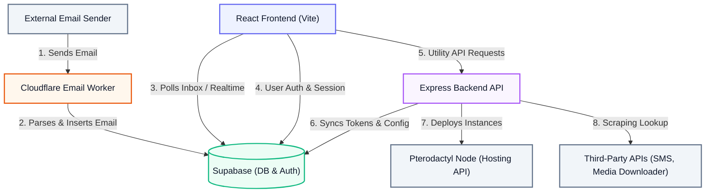

# CexiStore TempMail

A modern, privacy-first temporary email and persona protection platform. It provides disposable email routing, automated identity generation, SMS lookup tools, and hosting manager portals. The system is split into a React (Vite) Single Page Application, a Node.js Express API server, and a serverless email processing pipeline powered by Cloudflare Workers and Supabase.

---

## Executive Summary

CexiStore TempMail solves the problem of online footprint exposure and email spam. Instead of signing up for services with real credentials, users can generate temporary email personas and SMS numbers. 

### Key Capabilities
- **Serverless Email Ingestion**: Uses Cloudflare Email Routing + Cloudflare Workers to instantly parse and deliver incoming emails.
- **Identity Privacy Tools**: Instantly generates realistic virtual personas (names, phone numbers, virtual profiles).
- **Hosting Integration**: Fully integrated with Pterodactyl APIs to provision hosting plans and nodes directly from an administrative dashboard.
- **Media Ingestion Utilities**: Downloader scraping APIs supporting media retrieval from multiple platforms.

---

## System Architecture

The application is built on a decentralized, serverless architecture that decouples email ingestion from web application traffic. This ensures high availability and eliminates the need to run and maintain heavy mail transfer agents (MTAs) like Postfix or Exim.

### Architecture Topology



### Component Details
1. **Frontend Client (Vite + React)**: The main user interface. Uses Framer Motion for premium animations, Lucide Icons, and Supabase JS Client for session authentication and real-time polling of incoming messages.
2. **Email Workers (Cloudflare)**: Triggered directly by Cloudflare Email Routing events. Processes SMTP messages, extracts subject lines, body contents (text & HTML), and attachments, and writes them directly to Supabase via REST endpoints.
3. **Database (Supabase / PostgreSQL)**: Stores client profiles, generated aliases, active custom domains, and the incoming mail inbox.
4. **Backend Server (Express)**: Manages integrations like virtual phone provider scraping, Pterodactyl hosting provisioning, and platform media download lookups.

---

## Data Models

The system architecture uses the following database tables in Supabase for authentication, alias assignment, domain configurations, and email storage:

### `profiles`
Tracks user settings, plan levels, and credits.
| Column | Type | Description |
| :--- | :--- | :--- |
| `id` | `UUID` (PK) | References Supabase Auth UID. |
| `email` | `text` | User's sign-up email address. |
| `tokens` | `integer` | Balance available to generate temporary emails or VPS servers. |
| `plan` | `text` | Level tier (`Free`, `Standard`, `Pro`, `VVIP`, `Owner`). |
| `total_emails_generated` | `integer` | Count of email addresses generated. |
| `last_used_email` | `text` | Last generated email alias. |
| `is_admin` | `boolean` | Grants access to the administration dashboard. |
| `referral_code` | `text` | Unique referral identification string. |
| `created_at` | `timestamp` | Time of creation. |

### `temp_inbox`
Stores incoming emails processed by the serverless worker.
| Column | Type | Description |
| :--- | :--- | :--- |
| `id` | `bigint` (PK) | Auto-incrementing identifier. |
| `recipient` | `text` (Indexed) | The temporary email address target (e.g., `alias@domain.com`). |
| `sender` | `text` | The sender of the incoming email. |
| `subject` | `text` | Subject line of the email. |
| `body` | `text` | Content body (plain text or HTML payload). |
| `received_at` | `timestamp` | Date and time the email was ingested. |

### `active_emails`
Associates generated aliases with user profiles.
| Column | Type | Description |
| :--- | :--- | :--- |
| `id` | `bigint` (PK) | Unique row identifier. |
| `email` | `text` | The generated active temporary email. |
| `profile_id` | `UUID` (FK) | References `profiles.id`. |
| `created_at` | `timestamp` | Creation timestamp. |

### `domains`
Configured custom routing domains.
| Column | Type | Description |
| :--- | :--- | :--- |
| `id` | `bigint` (PK) | Domain identifier. |
| `domain` | `text` | The domain name (e.g., `temp-inbox.net`). |
| `is_active` | `boolean` | Controls whether the domain is available for alias generation. |
| `is_premium` | `boolean` | Restricts domain to Pro and VVIP tiers. |

---

## Design Decisions

### Serverless Email Processing
- **Decision**: Use Cloudflare Workers instead of running a persistent Node.js SMTP server listener.
- **Rationale**: Email reception is highly bursty. Running a full SMTP server exposes the host server to spam and DDoS vectors. By leveraging Cloudflare Email Workers, mail parsing is handled at the network edge. E-mails are converted to JSON and written to Supabase inside isolated environments, reducing infrastructure costs to zero.

### Decoupled Authentication
- **Decision**: Authenticate clients directly with Supabase JWTs rather than proxying credentials through the Express backend.
- **Rationale**: Relieves the Express API of password management and security auditing. Supabase handles login, session state, and password resets securely out-of-the-box.

---

## Development Setup

### Dependencies
Ensure Node.js v18+ is installed on your local system.

1. **Install root dependencies**:
   ```bash
   npm install
   ```

2. **Configure Environment Settings**:
   Create a `server/settings.js` with your credentials:
   ```javascript
   module.exports = {
       supabase_url: "https://your-project.supabase.co",
       supabase_key: "your-supabase-service-role-key",
       pterodactyl_url: "https://your-panel.com",
       pterodactyl_key: "your-application-key"
   };
   ```

3. **Start Development Servers**:
   - Run the frontend development hot-reload server:
     ```bash
     npm run dev
     ```
   - Run the backend Express server:
     ```bash
     node server/server.js
     ```

### Production Build
Build optimized frontend assets:
```bash
npm run build
```
Files will output to the `/dist` folder. The Express backend is pre-configured to serve these static assets automatically in production.
